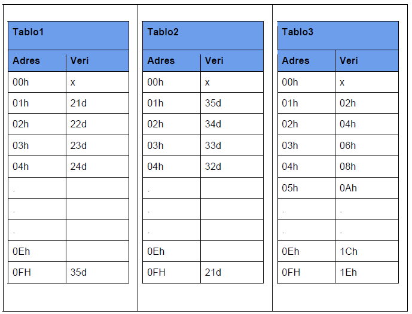
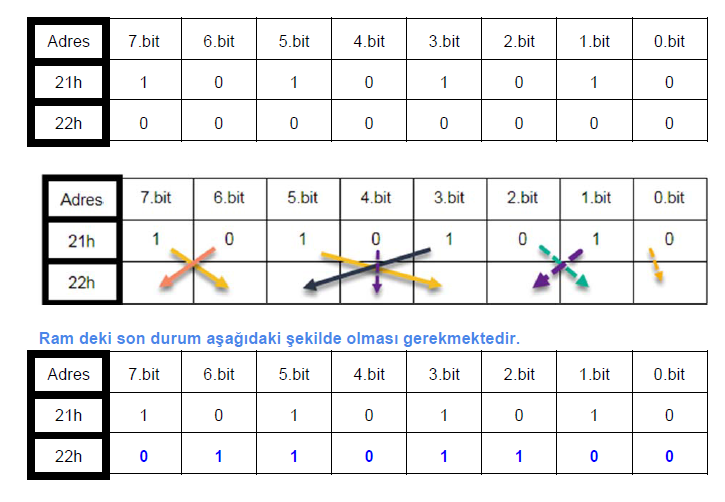
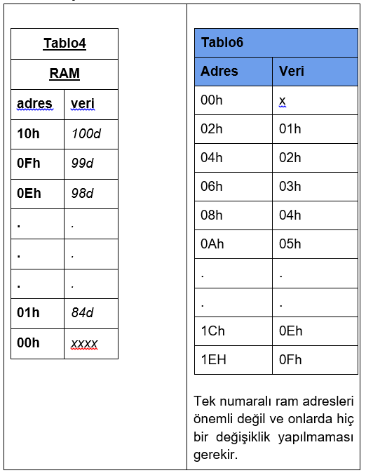

# Çalışma Soruları 1

[Çalışma Sorusu 1 : İndir](http://barakli.sakarya.edu.tr/sites/barakli.sakarya.edu.tr/file/cs11.pdf)

## Soru 1

Aşağıda verilen RAM (Tablo1) adres ve RAM içeriklerini 16 satırda direkt adresleme ile  yapınız. Döngü ve inc komutu kullanmayın. En basit şekilde yapınız.



### Cevap 1


```nasm
	org		0000
	
	mov		01h,#21d
	mov		02h,#22d
	//.
	//.
	//Buralari sirayla
	//alt alta yaz
	//.
	//. 
	mov		0EH,#34d
	mov		0FH,#35d
	
	end
```

## Soru 2

Tablo 1’de ki yapıyı dolaylı adresleme, djnz ve dec kullanarak yapınız.(Ram sıfırlama mantıgını (dolaylı adresleme mantıgını) tam kavradıysan bu soru üzerinde biraz düşün daha sonra kod yazmaya başla).

### Cevap 2

> Dolaylı adresleme için r0 ve r1 kaydedicilerini kullanmamız gerekir. Aynı zamanda dikkat edilmesi gereken bir durum ise @r0 kullanımda ilgili banktaki r0 (bulunduğumuz bank) kullanılıyor olduğudur.

```c
    char r0=0fh;
    char 07f=35d
    while(i>0)
    {
        @r0=07f; // 07f adresindeki veri @r0'a atanmıştır.
        07f--; 
        r0--;
    }
```

> Yukarıda verilen bir c prototipidir. Mantık olması açısından asm dili tagları ile karışık verilmiştir. c kodu olarak çalışmaz.
>
> Şuanda sadece djnz ve dec kodlarını biliyor olmamızdan dolayı aşağıda verilen koddaki gibi yapılabilir.
>
> r0, atama yapılacak olan registerları belirleyecek ve her döngüde 1 azalacak.
>
> 7fh adresine de, atanacak olan sayılar sırayla gelecektir.
>
> 7fh adresi keyfi olarak belirlenmiştir. Siz tablodaki kaydediciler hariç istediğinizi belirleyebilirsiniz.
>
> 00h adresindeki değer zaten r0 olarak kulanıldığından x olarak verilmiştir.

```nasm
	org		0000
	// başlangıç değerleri
	mov		r0,#0fh 
	mov		7fh,#35d

basla:
	mov		@r0,7fh
	dec		7fh
	djnz	r0,basla // r0=0 değil ise basla'ya dön
	
	end
```

## Soru 3

Tablo 2’deki yapıyı dolaylı adresleme, djnz ve inc kullanarak yapınız.

### Cevap 3

> Soru2 deki 7fh adresinin ilk değeri değişecektir ve kod içinde dec yerine inc kullanılacaktır.

```nasm
	org		0000
	
	mov		r0,#0fh
	mov		7fh,#21d

basla:
	mov		@r0,7fh
	inc		7fh
	djnz	r0,basla
	
	end
```

## Soru 4

Tablo 3’teki yapıyı gerçekleyiniz.

### Cevap 4:

> Veriler 2 şer azaldığınan 2 kere dec sırayla kullanılmıştır.

```nasm
	org		0000
	
	mov		r0,#0fh
	mov		7fh,#1eh

basla:
	mov		@r0,7fh
	dec		7fh
	dec		7fh
	djnz	r0,basla
	
	end
```

## Soru 5

**mov  22h,#00h**

**mov  21h,#10101010b** şeklindeki komutlardan sonra oluşan ram durumu aşağıda ilk tabloda verilmiştir. Bit taşıma ile 22h adresini aşağıda verilen ok durumlarına göre oluşturunuz.



### Cevap 5

> Bit taşıma işlemleri c biti üzerinden olmaktadır. Ayrıca 20h ile 2fh bayt adreslerinin her bitine ait adreslemeleri bilmemiz gerekir. Örnek olarak: 20h adresinin ilk biti 00h olarak adreslenir. Ders dökümanını kontrol ediniz.

```nasm
	org		0000
	// başlangıç değerleri
	mov  	22h,#00h
	mov		21h,#10101010b

	// bit taşıma işlemleri
	mov		c,08h
	mov		10h,c
	
	mov		c,09h
	mov		12h,c
	
	mov		c,0ah
	mov		11h,c
	
	//.
	// digerlerini siz yapiniz.
	//.
	
	mov		c,0fh
	mov		16h,c
	
	end
```

## Soru 6

DJNZ komutu ve dolaylı adresleme kullanarak Tablo 4’de verilen adreslere karşılarındaki verileri oluşturunuz.



### Cevap 6

```nasm
	org		0000
	
	mov		r0,#10h
	mov		25h,#100d // keyfi olarak 25h adresi belirlendi
	
basla:
	mov		@r0,25h
	dec		25h
	djnz	r0,basla // r0 0 degil ise baslaya git
	end
```

## Soru 7

DJNZ komutu ve dolaylı adresleme kullanarak Tablo 6’da verilen adreslere karşılarındaki verileri oluşturunuz.

### Cevap 7

```nasm
	org		0000
	
	mov		r0,#1Eh
	mov		25h,#0fh // keyfi olarak 25h adresi belirlendi
	
basla:
	mov		@r0,25h
	dec		25h
	
	dec		r0 
	djnz	r0,basla // r0 0 degil ise baslaya git
	end
```

